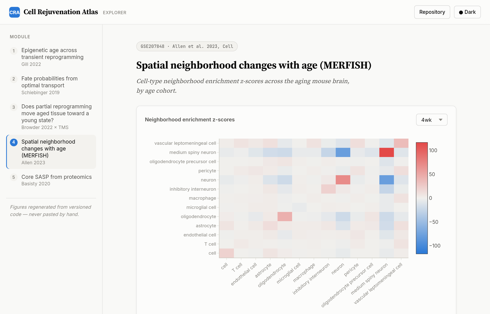
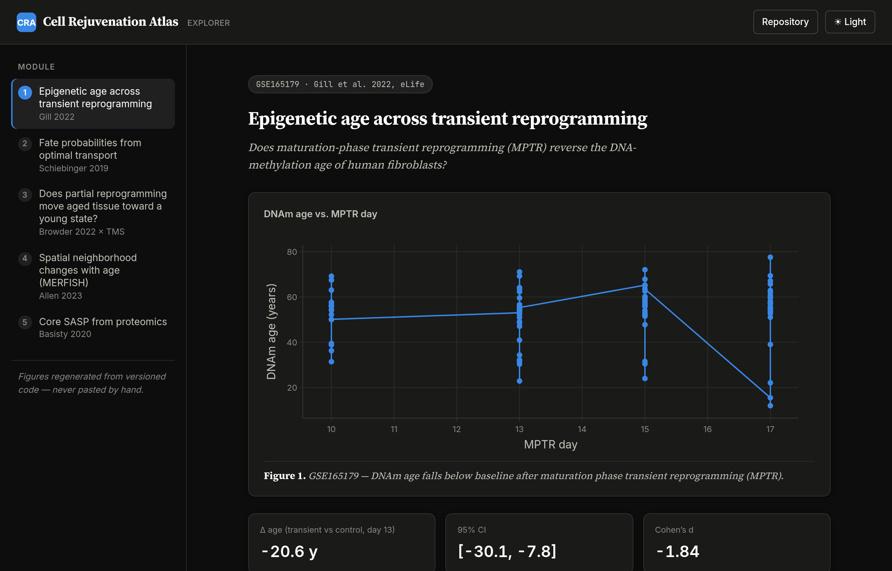

# Cell Rejuvenation Atlas

**A fully reproducible, cloud-scale reanalysis of peer-reviewed multi-omics data on cellular aging, reprogramming, and rejuvenation — from raw reads to an interactive exploration app.**

[](https://github.com/lynchaos/cell-rejuvenation-atlas/actions/workflows/ci.yml)
[](https://www.nextflow.io/)
[](LICENSE)

Every dataset in this repository is **public, peer-reviewed, and cited** (see [DATASETS.md](DATASETS.md) for papers, DOIs, and repository accessions). Every figure is regenerated by code. Nothing is copy-pasted from supplementary tables.

<table>
<tr>
<td width="50%">

<sub><b>Explorer</b> — module 4, MERFISH neighborhood enrichment, age-cohort selector, light mode.</sub>
</td>
<td width="50%">

<sub><b>Explorer</b> — module 1, epigenetic-age time course, dark mode (charts re-theme, not just chrome).</sub>
</td>
</tr>
</table>

A static, server-free page generated straight from `results/` — see [Exploring results](#exploring-results).

---

## Why this repository exists

This project demonstrates an end-to-end computational biology workflow in the aging/rejuvenation field:

1. **Reproduce** headline findings from landmark papers (epigenetic age reversal by transient reprogramming; reprogramming trajectories; age-dependent spatial reorganization of the brain).
2. **Integrate** across studies, modalities, and species with modern probabilistic/generative methods (scVI, MOFA-style factor models, optimal transport).
3. **Engineer** the whole thing to production standard: Nextflow DSL2, containers, CI, AWS Batch, tests, docs.
4. **Communicate** results through an interactive app for wet-lab and computational collaborators alike.

## Requirement-to-module map

| Competency (from a typical computational-biology scientist job spec in aging/rejuvenation) | Where it is demonstrated |
|---|---|
| Cellular aging / rejuvenation / reprogramming biology | Modules 1, 2, 3, 5 — biologically motivated analyses of rejuvenation, trajectories, SASP |
| Single-cell & spatial omics | Module 2 (scRNA-seq), Module 4 (MERFISH spatial) |
| Epigenomics (DNA methylation) | Module 1 (EPIC array reanalysis, epigenetic clocks) |
| Proteomics | Module 5 (SASP Atlas, DIA-NN output reanalysis) |
| Multi-omics data integration | Module 3 (scVI integration; cross-study signature transfer) |
| Machine learning / deep learning / generative modeling | Module 1 (elastic-net clocks), Module 2 (optimal transport), Module 3 (scVI VAE, perturbation prediction) |
| Reproducible workflows, Nextflow, AWS | `main.nf`, `modules/`, `conf/`, Docker, GitHub Actions CI |
| Interactive visualization tools | `app/` — Rejuvenation Explorer (Streamlit, live dev view) and `site/` — static Explorer (server-free, publication-styled) |

## Architecture

```
cell-rejuvenation-atlas/
├── main.nf                  # Nextflow DSL2 entry point (all modules)
├── nextflow.config          # local / docker / awsbatch profiles
├── conf/                    # profile configs incl. AWS Batch
├── modules/                 # Nextflow processes (DSL2)
├── src/
│   ├── module1_rejuvenation_clock/      # Gill et al. 2022 (eLife): methylome + transcriptome of rejuvenated human fibroblasts
│   ├── module2_reprogramming_trajectory/# Schiebinger et al. 2019 (Cell): 250k-cell reprogramming time course + WOT
│   ├── module3_multiomics_integration/  # Browder 2022 (Nat Aging) + Tabula Muris Senis 2020 (Nature): scVI integration
│   ├── module4_spatial_aging/           # Allen et al. 2023 (Cell): MERFISH aging brain, Squidpy
│   ├── module5_proteomics_sasp/         # Basisty et al. 2020 (PLoS Biol): SASP Atlas proteomics
│   └── common/                          # shared I/O, plotting, stats utilities
├── app/                     # Rejuvenation Explorer (Streamlit, live dev view)
├── site/                    # static Explorer (server-free, publication-styled)
├── docker/                  # container definitions
├── tests/                   # pytest suite (synthetic data, runs in CI)
├── docs/                    # rendered documentation site
└── reports/                 # per-module analysis reports (generated)
```

## Quickstart

```bash
# 1. Clone and set up
git clone https://github.com/lynchaos/cell-rejuvenation-atlas.git
cd cell-rejuvenation-atlas
conda env create -f environment.yml && conda activate rejuvenation-atlas

# 2. Run the full pipeline locally on the bundled test data (CI does this on every push)
nextflow run main.nf -profile test,docker

# 3. Run a single module on the real data (downloads from GEO/PRIDE automatically)
nextflow run main.nf -profile docker --module rejuvenation_clock

# 4. Run at scale on AWS Batch
nextflow run main.nf -profile awsbatch --module all
```

Each `src/module*/README.md` documents the biology, the data, the methods, and a **"reproduced vs. published"** comparison.

## Exploring results

Two front ends read the same `results/` directory — pick whichever fits the moment.

**Rejuvenation Explorer (Streamlit)** — a live dev view: hot-reloads as a module reruns, good while
you're iterating on a module.

```bash
streamlit run app/streamlit_app.py -- --results results/
```

**Static Explorer** — a server-free, publication-styled build: a single self-contained HTML page
(charts, tables, and figures inlined; Plotly.js is the only external file), with a dark-mode toggle
that re-themes the charts themselves, sortable tables, and per-table CSV downloads. No Python
process needed to view it — open the file directly, or host it anywhere static files are served
(GitHub Pages, S3, a shared drive).

```bash
python site/build.py --results results/ --out site/public
xdg-open site/public/index.html   # or: open site/public/index.html on macOS
```

See [site/README.md](site/README.md) for design notes and deployment options.

## Reproducibility statement

* All analyses are deterministic given pinned environments (`environment.yml`, Docker images with digest-pinned bases).
* Data are pulled programmatically from GEO / PRIDE / cellxgene with checksums recorded in `reports/data_manifest.json`.
* CI runs the complete pipeline on synthetic test data in < 10 minutes on every push.

## Citing the underlying data

If you use outputs of this repository, cite the original studies listed in [DATASETS.md](DATASETS.md) — the credit belongs to the groups who generated the data.

## License

Copyright (C) 2026 Kemal Yaylali.

This program is free software: you can redistribute it and/or modify it under
the terms of the GNU Affero General Public License as published by the Free
Software Foundation, either version 3 of the License, or (at your option) any
later version. See [LICENSE](LICENSE) for the full license text.

Code and documentation in this repository are licensed under AGPL-3.0.
Reanalyzed datasets remain the property of their original studies (see
[DATASETS.md](DATASETS.md)) and are subject to the terms of their hosting
repositories.

For support or licensing inquiries:
- support@yaylali.uk
- kemal.yaylali@gmail.com
- https://kemal.yaylali.uk
- https://kemalyaylali.bio
